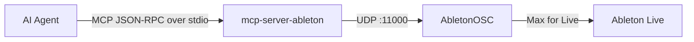
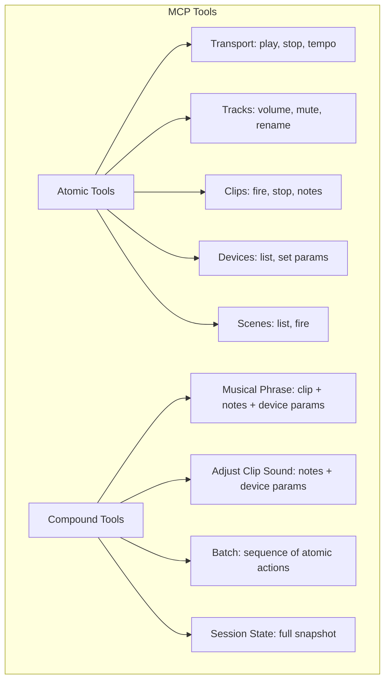

# mcp-server-ableton

[Model Context Protocol](https://modelcontextprotocol.io/) server for [Ableton Live](https://www.ableton.com/), enabling AI agents to control your Ableton session over OSC.

## Architecture





The server communicates with Ableton Live through [AbletonOSC](https://github.com/ideoforms/AbletonOSC), a Max for Live device that exposes Ableton's API over OSC (UDP). The MCP server translates tool calls into OSC messages and parses the responses.

## Requirements

- Ableton Live with [AbletonOSC](https://github.com/ideoforms/AbletonOSC) loaded as a Max for Live device

## Usage

### Claude Desktop / Claude Code

With uvx:

```json
{
  "mcpServers": {
    "ableton": {
      "command": "uvx",
      "args": ["mcp-server-ableton"]
    }
  }
}
```

With rvx:

```json
{
  "mcpServers": {
    "ableton": {
      "command": "rvx",
      "args": ["mcp-server-ableton"]
    }
  }
}
```

<details>
<summary>Other installation methods</summary>

**Nix:**

```bash
nix run github:vaporif/mcp-server-ableton
```

**Cargo:**

```bash
cargo install --git https://github.com/vaporif/mcp-server-ableton
```

**GitHub Releases:**

Download prebuilt binaries from [Releases](https://github.com/vaporif/mcp-server-ableton/releases).

</details>

### AbletonOSC Setup

Install the bundled AbletonOSC device into your Ableton User Library:

```bash
mcp-server-ableton install
```

Then drag AbletonOSC from your User Library onto any track in Ableton.

## Tools

Tools are designed for bulk operations — compound tools combine multiple actions into a single MCP call to minimize round-trips between the agent and server.

| Category | Tools |
|---|---|
| Transport | play, stop, get/set tempo |
| Tracks | list, rename, volume, mute/unmute, mixer, detail |
| Scenes | list, fire |
| Clips | fire, stop, name, create MIDI clip, add/get/remove notes |
| Devices | list, parameters, set parameter(s) |
| Templates | list template tracks, create track from template |
| Compound | create clip with notes, musical phrase, adjust clip sound, set multiple device params |
| Batch | execute a sequence of arbitrary actions in one call with configurable error handling |
| Session | full session state snapshot (tracks, scenes, mixer, devices) |

Every tool response includes a `session_summary` with current tempo, playback state, and selected track for context.

## Debugging

```bash
RUST_LOG=debug mcp-server-ableton
```

## Development

```bash
nix develop
just setup-hooks
just check
```

## Credits

- [AbletonOSC](https://github.com/ideoforms/AbletonOSC) by Daniel Jones - Max for Live device providing OSC control of Ableton Live

## License

GPL-3.0-or-later
